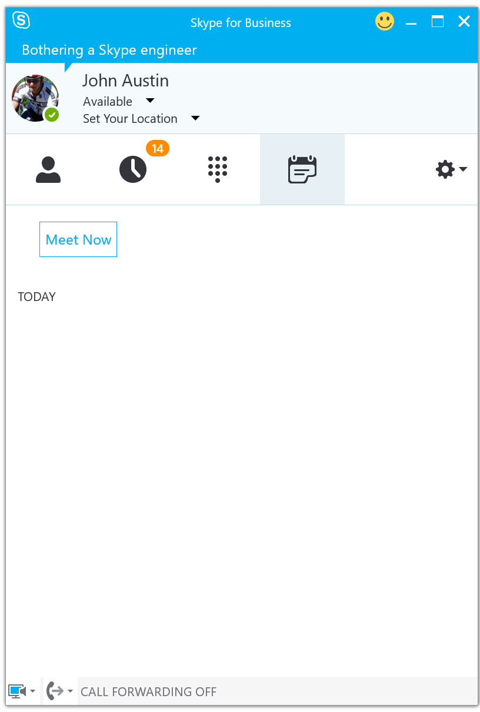
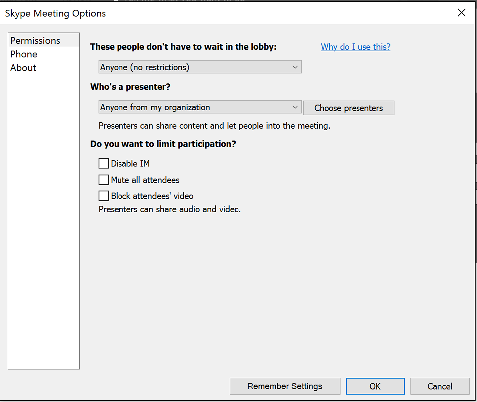

# Get a Skype for Business meeting URL
If you have not written a server-side feature to schedule a meeting and return a new meeting URL, you can
still get a meeting URL and develop against a live meeting. Users of your production app will rely on server
logic to return a new meeting whenever they use the join meeting feature of the **App SDK**.


## While developing your app
While your app is in development, you can create your own anonymous Skype for Business meeting as long as you are
a licensed user of Skype for Business. There are two easy ways to do this.

* Start an ad-hoc meeting from your **Skype for Business** desktop client as shown in figure 1. 

  

* Schedule a **Skype for Business** meeting in outlook. You can set the meeting to run for multiple
days so that you don't need to get a new meeting URL whenever you are testing your code.

 
 
Be sure to check the meeting options for the new meeting. The lobby waiting option must be disabled for anyone who enters the meeting.
as shown in figure 3

  

Once you have the meeting URL, fill the ``` conversation = mSkypeApplication
                    .getConversationsManager()
                    .getOrCreateConversationMeetingByUri(meetingUri);
```

 ### Get the meeting URL
 
 Join the meeting you scheduled in the previous step. The **Skype for Business** meeting window has a  round "..." button at the 
 bottom right corner of the window. Click the button and choose the **Meeting Entry Info** option from the 
 context menu. The dialog that opens shows a **Meeting Link** field which contains the URL that you'll use to join the
 meeting.  
 
 
 
 
 ## In production
 
 To create new meetings on demand and send the new meeting URL to your mobile app, you'll 
 write a UCWA-based server application that makes server-to-server REST calls into a **Skype for Business** server
 to create a meeting and get the meeting URL. You will need to write a client-side feature to
 communicate with your server application to initiate this transaction and get the
 returned meeting URL.
 
 See [Schedule a meeting](https://ucwa.skype.com/documentation/KeyTasks-OnlineMeeting-ScheduleMeeting ) to learn about scheduling a meeting using UCWA.