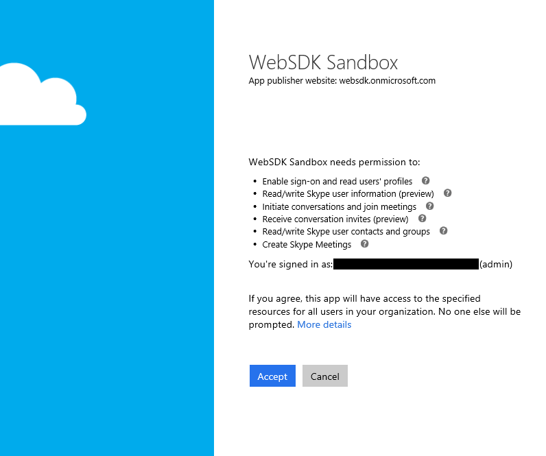

# AAD Auth Failures - Calling principal cannot consent due to lack of permissions

_**Applies to:** Skype for Business 2015_

## Who is this article for?

If you are attempting to use the Azure AD authentication option to sign into the Skype for Business Web SDK and you are seeing an AAD error page that looks like the following then this page is for you. The page should have this message: "Calling principal cannot  consent due to lack of permissions."

If this is not your issue, you can return to [this page](./AADAuthFailures.md) for a list of other potential issues.

## The Issue

You are either trying to sign in with a non-administrator account in the tenant where you have registered your application before an admin has signed in and provided consent, or the admin revoked or denied permission for all users in the tenant and has not yet re-consented. 

Alternatively, you may have incorrectly configured the permissions required by your app for accessing the Skype for Business Online API. If the steps in this guide don't work for you or you believe this is the case, follow [this guide](./AADAuth-DelegatePermissions.md) instead.

## The Solution

When configuring the app through AAD to use the SfB online APIs, you must sign in as a tenant admin the first time and consent on behalf of all users in the tenant to access the Skype for Business online APIs.

If you have correctly configured the permissions required by your application, the first time you sign in as an administrator you should see a prompt that looks like this:

Note the text at the bottom that reads "If you agree, this app will have access to the specified resources for all users in your organization. No one else will be prompted." If you don't see this text, follow the steps below to force the admin consent prompt to reappear.

### Forcing the Admin Consent Prompt to Appear

After removing consent by deleting the enterprise application in AAD or denying consent as an admin when first prompted, you may have to manually force AAD to prompt you to reconsent by navigating to this URL (replacing YOUR\_CLIENT\_ID and YOUR\_APP\_URL with the appropriate values) and signing in with an admin account: 
> **https://login.microsoftonline.com/common/oauth2/authorize?response_type=id_token&client_id=YOUR_CLIENT_ID&redirect_uri=YOUR_APP_URL&response_mode=form_post&resource=https://webdir.online.lync.com&prompt=admin_consent**

If you navigated to this URL, after successfully signing in with an admin account for your tenant you should see an admin consent prompt like the one shown above.

If none of the above works, you may have configured the permissions for your application incorrectly. Follow [this guide](./AADAuth-DelegatePermissions.md) for step-by-step instructions on how to specify permissions and what permissions to specify your app needs to access the Skype Web SDK APIs. In particular, ensure that you have checked _all_ of the **Delegated permissions** and _none_ of the **Application permissions** for the Skype for Business Online API.

## Related Topics

- [Assigning Administrator roles in Azure Active Directory](https://docs.microsoft.com/en-us/azure/active-directory/active-directory-assign-admin-roles)
- [Delegating Permissions for your Skype Web SDK Application](./AADAuth-DelegatePermissions.md)
- [Troubleshooting AAD Auth Failures for Skype Web SDK](./AADAuthFailures.md)
- [Integrating Applications with Azure Active Directory](https://docs.microsoft.com/en-us/azure/active-directory/active-directory-integrating-applications)

