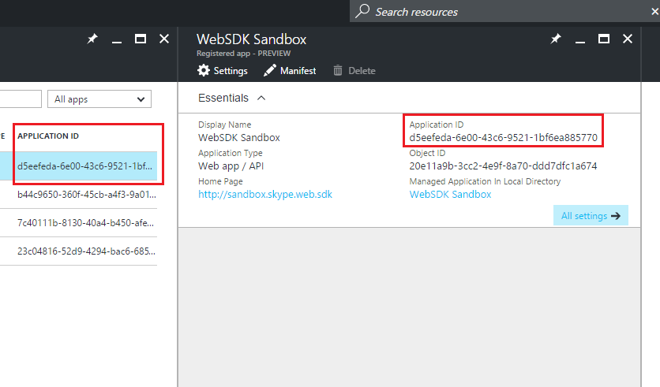

# AAD Auth Failures - Application with identifier <...> was not found in the directory <...>

_**Applies to:** Skype for Business 2015_

## Who is this article for?

If you are attempting to use the Azure AD authentication option to sign into the Skype for Business Web SDK and you are seeing an AAD error page that looks like the following then this page is for you. The page should have this message: "Application with identifier  <...> was not found in the directory <...>."


If this is not your issue, you can return to [this page](./AADAuthFailures.md) for a list of other potential issues.
 
## The Issue

You are providing an incorrect client ID when redirecting to AAD or when calling `signInManager.signIn`. You provide a client ID in 2 places when using AAD auth to sign into the Skype Web SDK:

- When initially redirecting to the AAD sign in page, you probably use code that looks like this to navigate to the URL of the sign in page. If instead of using your own client_id here, you are using a default one from the samples or another invalid ID, you will see this error.
``` js
var href = 'https://login.microsoftonline.com/common/oauth2/authorize?response_type=token&client_id=';
href += client_id + '&resource=https://webdir.online.lync.com&redirect_uri=' + window.location.href;
window.location.href = href;
```
- After entering your credentials in the AAD sign in page and being redirected back to your app page, when performing the actual `signInManager.signIn`, you should specify a client_id parameter. If you are using a default or incorrect value for the client_id, you will see this error.
``` js
application.signInManager.signIn({
    version: config.version,
    client_id: client_id, // **Must use your client ID from AAD configuration**
    origins: ["https://webdir.online.lync.com/autodiscover/autodiscoverservice.svc/root"],
    cors: true,
    redirect_uri: location.href + location_config.token + '/token.html'
})
```

## The Solution

You need to provide a valid client ID when redirecting to AAD to sign in and then again when signing in with `signInManager.signIn`.

The client ID is created when you create an app registration for your web application in Azure AD. You can find it again by signing into **portal.azure.com**, finding Azure Active Directory on the side bar, clicking **App registrations**, then clicking on the app that you're trying to sign into the Skype Web SDK with.

You can find your client ID in a couple different places as indicated in the image below.



Use this client ID in both the places mentioned in the above section, and you should stop seeing this error.

## Related Topics
- [Troubleshooting AAD Auth Failures for Skype Web SDK](./AADAuthFailures.md)
- [Integrating Applications with Azure Active Directory](https://docs.microsoft.com/en-us/azure/active-directory/active-directory-integrating-applications)
