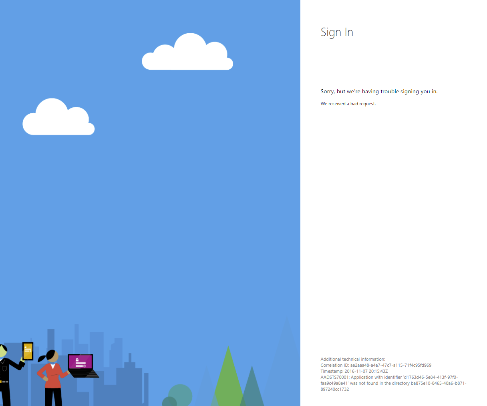
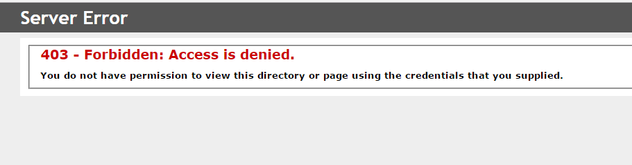
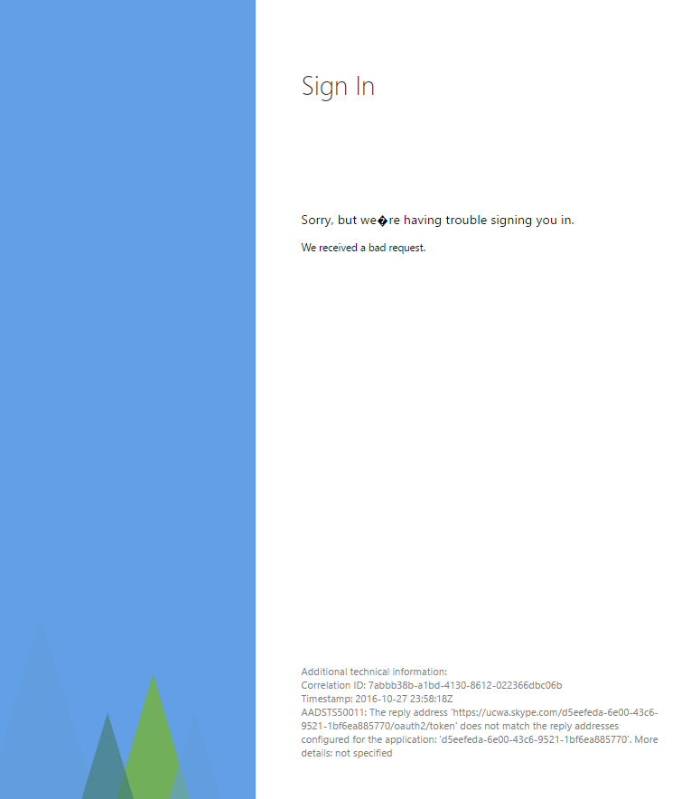
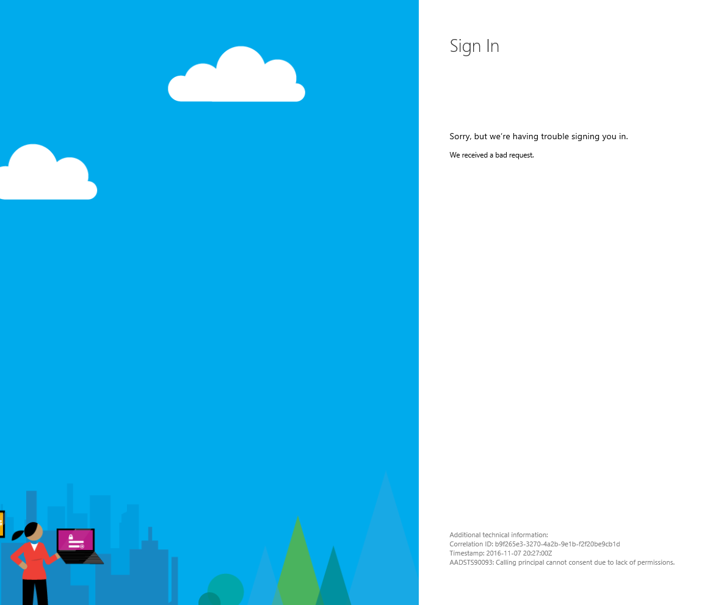

# Possible Authentication failures

- Incorrect Client ID


- No cors


- No reply URL with cors signin in IE


- Manifest doesn't allow implicit OAuth


- tenant admin hasn't provided consent



- Haven't delegated app permissions correctly


- Running web app in IE from localhost and having crossed security zone issue -- hard to capture a photo. Basically in Fiddler you see a redirect request that includes an error description. This is the full text: 

```http
http://localhost/#error=login_required&error_description=AADSTS50058%3a+A+silent+sign-in+request+was+sent+but+no+user+is+signed+in.+The+cookies+used+to+represent+the+user%27s+session+were+not+sent+in+the+request+to+Azure+AD.+This+can+happen+if+the+user+is+using+Internet+Explorer+or+Edge%2c+and+the+web+app+sending+the+silent+sign-in+request+is+in+different+IE+security+zone+than+the+Azure+AD+endpoint+(login.microsoftonline.com).%0d%0aTrace+ID%3a+400f7474-a075-4e95-bdec-0b558554a90c%0d%0aCorrelation+ID%3a+0bffffde-0199-491b-a4db-516eaefcf642%0d%0aTimestamp%3a+2016-11-08+18%3a00%3a51Z&state=d8938bdf2505c.1
```